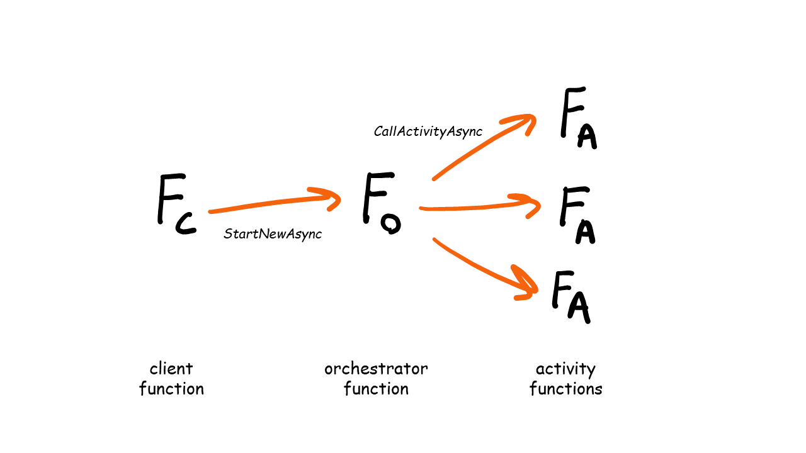
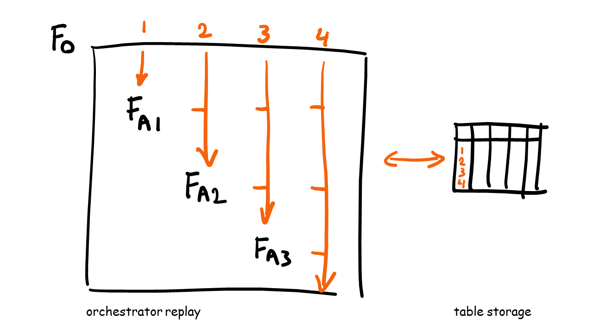

# Durable Functions

Durable Functions allows you to write workflows (orchestrations) in code. The state of the workflow instances are stored which enables many use cases such as:

- Chaining function calls.
- Execute functions in parallel and wait for their completion (fan-out/fan-in).
- Waiting for external events.
- Executing long running, and even eternal workflows.

You can use Durable Functions in C# by referencing the [Microsoft.Azure.WebJobs.Extensions.DurableTask](https://www.nuget.org/packages/Microsoft.Azure.WebJobs.Extensions.DurableTask) NuGet package.

## Function types

Durable Functions uses four types of functions:

- Client functions
- Orchestrator functions
- Activity functions
- Entity functions



### Orchestrator Functions

Orchestrator functions define the workflow as code. It contains the logic which steps (activities) are performed, and in which order.

This is an example of an orchestrator where two functions are chained. The second activity function (`UpdatePlayerScoreActivity`) requires the output of the first activity function (`GetPlayerActivity`).

```csharp
[FunctionName(nameof(UpdatePlayerScoreOrchestrator))]
public async Task Run(
    [OrchestrationTrigger] IDurableOrchestrationContext context,
    ILogger logger)
{
    var playerId = context.GetInput<string>();

    var player = await context.CallActivityAsync<Player>(
        nameof(GetPlayerActivity),
        playerId);
    
    await context.CallActivityAsync(
        nameof(UpdatePlayerScoreActivity),
        player);
}
```

#### Orchestrator Replay



It is important to realize that an orchestrator function is not executed once. It is replayed several times, depending on the number of activities it calls. For each activity the orchestrator calls, the orchestrator execution is stopped. As soon as an activity is done, the orchestrator restarts. Since the state of the orchestrator instance is persisted (including the inputs and outputs of activity functions) it won't execute activity functions multiple times. The Durable Functions framework checks if the activity function has been executed and if so, it will retrieve the state to use that in the orchestrator.

### Activity Functions

Activity functions are the units of work which the workflow orchestrates. These functions usually deal with calling external APIs and interacting with databases.

The Durable Function framework guarantees that activity functions are executed at least once as part of an orchestrator.

```csharp
[FunctionName(nameof(GetPlayerActivity))]
public async Task<Player> Run(
    [ActivityTrigger] string playerId,
    ILogger logger)
{
    // Call external API or database.
    // var player = await gamePlayerService.GetPlayerAsync(playerId);
    // return player;
}
```

### Client Functions

A client function is responsible for creating a new instance of a workflow, also known as an orchestrator instance. It can perform other operations on an orchestrator instance as well, such as: querying the orchestrator state, and terminating the instance.

```csharp
[FunctionName(nameof(UpdatePlayerScoreClient))]
public static async Task<HttpResponseMessage> Run(
[HttpTrigger(
    AuthorizationLevel.Function,
    nameof(HttpMethod.Post),
    Route = null)] HttpRequestMessage message,
[DurableClient] IDurableClient client,
ILogger logger)
{
    var playerId = await message.Content.ReadAsAsync<string>();

    string instanceId = await client.StartNewAsync(
        nameof(UpdatePlayerScoreOrchestrator),
        playerId);

    return client.CreateCheckStatusResponse(message, instanceId);
}
```

### Entity Functions

Entity functions are described in [this section](statefulentities.md).

## Official Docs

[Durable Functions Overview](https://docs.microsoft.com/en-us/azure/azure-functions/durable/durable-functions-overview?tabs=csharp)

---
[🔼 Notify Support Challenge](../NotifySupport/lesson/notifysupport.md) | [Sub-orchestrations ▶](suborchestrations.md)
