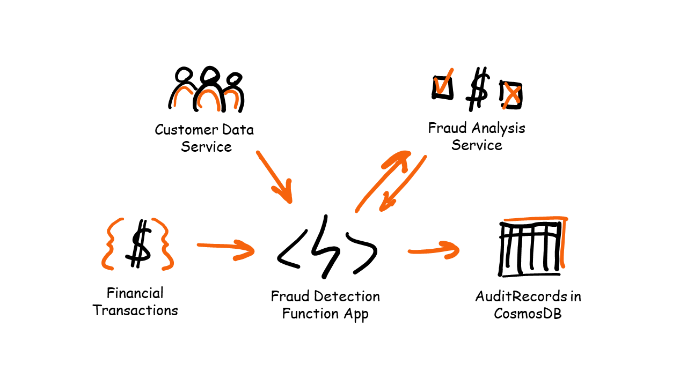
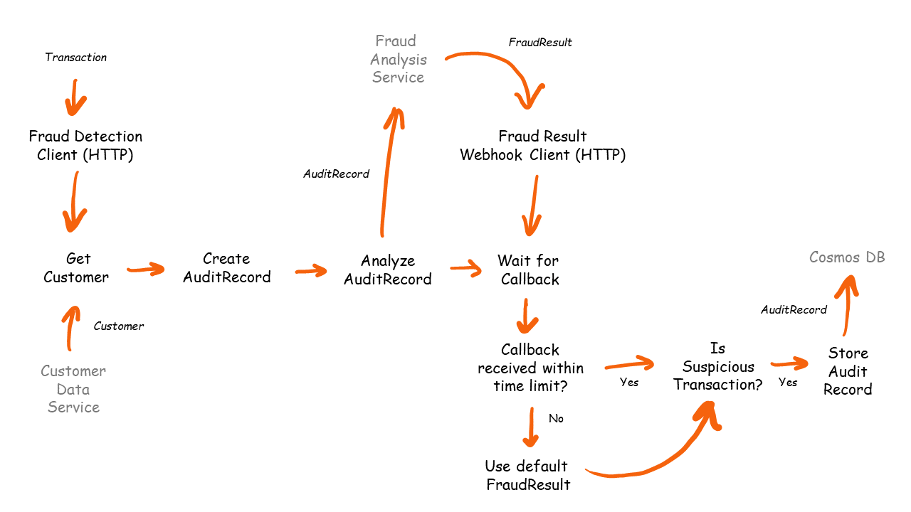

# Fraud Detection Challenge

## Goal

The goal of this challenge is to write a Function App that:

- responds to incoming financial transactions (posted via HTTP),
- combines the transaction with customer data,
- sends the combined data to a 3rd party web service to be analyzed,
- waits for the analysis result to be returned via a webhook,
- stores the combined data and analysis result to CosmosDB.



## Flow Diagram



## Prerequisites

Read the [prerequisites](prerequisites.md) to ensure you have all the right tools installed.

## Durable Functions Theory

Please familiarize yourself with some Durable Functions theory and code samples. These are the building blocks for the solution.

- [Client, Orchestrator & Activity functions](../../DurableFunctionsTheory/durablefunctions.md)
- [Events](../../DurableFunctionsTheory/events.md)
- [Stateful Entities](../../DurableFunctionsTheory/statefulentities.md)

## Requirements

The following requirements have been defined for the  serverless application you'll write:

1. The Function App should respond to an incoming HTTP POST request on a static URL (e.g. `http://localhost:7071/api/FraudDetectionClient`). The body should contain one transaction in the following format (also see the [`Transaction`(link)](../src/DurableFunctions.UseCases.FraudDetection/Models/Transaction.cs) definition):

    ```json
    {
        "id" : "{{$guid}}",
        "creditorBankAccount" : "CR{{$guid}}",
        "debtorBankAccount" : "DB{{$guid}}",
        "amount" : "{{$randomInt 100 1000}}",
        "currency" : "USD",
        "timeStampUtc" : "{{$datetime iso8601}}",
    }
    ```

     > This json example uses the [VS Code REST client](https://marketplace.visualstudio.com/items?itemName=humao.rest-client) extension to generate random values.

    > For more info about *Azure Functions HttpTriggers* see this [Azure Functions University lesson](https://github.com/marcduiker/azure-functions-university/blob/main/lessons/dotnetcore31/http/http-lesson-dotnet.md).
2. The transaction contains bank accounts but no customer data (like names or country codes) that is required by the fraud detection service. The Function App should call a service to retrieve customer data for both the creditor and the debtor based on the bank account number from the transaction. This service returns a [`Customer`(link)](../src/DurableFunctions.UseCases.FraudDetection/Models/Customer.cs) object.

    > For this challenge I don't expect you to use a real customer data service. You can use my approach and have an activity function call a [FakeCustomerDataService](../src/DurableFunctions.UseCases.FraudDetection/Services/FakeCustomerDataService.cs) that generates customer data based on [Bogus](https://github.com/bchavez/Bogus).

3. The Function App should call a 3rd party web service that performs fraud detection analysis on the combined set of transaction and customer data, aka an [`AuditRecord`(link)](../src/DurableFunctions.UseCases.FraudDetection/Models/AuditRecord.cs). This web service accepts a POST with one `AuditRecord` as the payload. This service does not return the analysis result immediately, instead it will send back an Accepted response (HTTP status 202). Once the result is ready, the web service triggers a webhook with a `FraudResult` result in the body (see step 4).

    > For this challenge I don't expect you to use a real fraud detection service. You can either make (or fake) a call to some other service (e.g [webhook.site](https://webhook.site/) and 'trigger' the webhook yourself via a REST client. Or you can follow [my example](../src/DurableFunctions.UseCases.FraudDetection/Activities/AnalyzeAuditRecordActivity.cs) and make a call to GitHub to start a [workflow](../../.github/workflows/frauddetection_webhook.yml) which calls the webhook to your local Function App (via ngrok).

4. The Function App should expose an HTTP trigger function on a static URL (e.g. `http://localhost:7071/api/FraudResultWebhookClient`) that is used as the webhook in step 3. This endpoint should only allow POST requests and the request body is expected to contain the following payload (also see the [`FraudResult`(link)](../src/DurableFunctions.UseCases.FraudDetection/Models/FraudResult.cs) definition):

    ```json
    {
        "recordId": "<string ID of the AuditRecord that has been submitted for analysis>",
        "isSuspiciousTransaction":  "<boolean result>"
    }
    ```

5. When `isSuspiciousTransaction` is `true`, the Function App should store the `AuditResult` (including the `IsSuspiciousTransaction` property) in a document collection (*auditrecords*) in a CosmosDB database (*frauddetection*).

---
[🔼 Main README](../../README.md)