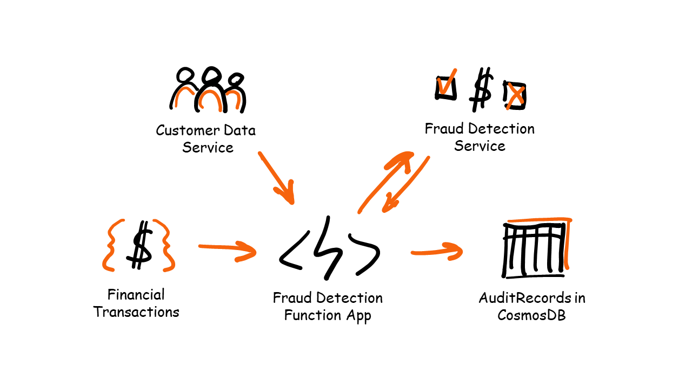
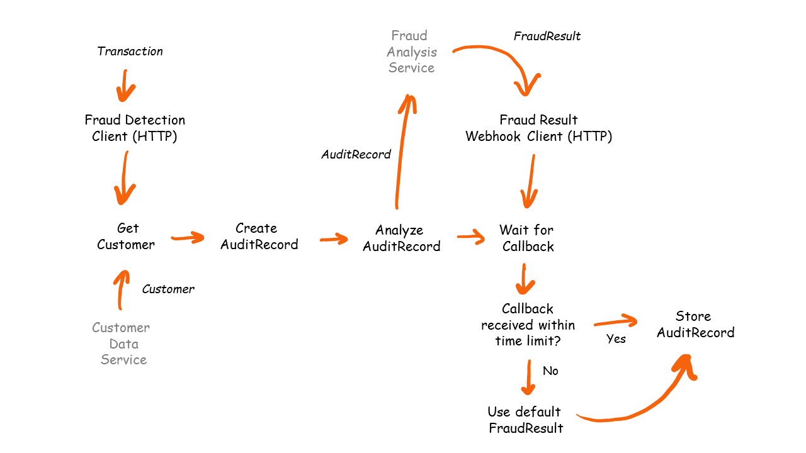

# Fraud Detection Challenge

## Goal

The goal of this challenge is to write a Function App which responds to incoming financial transaction (posted as HTTP request), send them to a 3rd party web service to be analyzed, and wait for the analysis result to be returned via a webhook.



## Flow Diagram



## Prerequisites

Read the [prerequisites](prerequisites.md) to ensure you have all the right tools installed.

## Durable Functions Theory

Please familiarize yourself with some Durable Functions theory and code samples. These are the building blocks for the solution.

- [Client, Orchestrator & Activity functions](../../DurableFunctionsTheory/durablefunctions.md)
- [Events](../../DurableFunctionsTheory/events.md)
- [Stateful Entities](../../DurableFunctionsTheory/statefulentities.md)

## Requirements

The serverless application you'll write, need to do the following things:

1. Respond to an incoming HTTP POST request on a static URL (e.g. `http://localhost:7071/api/FraudDetectionClient`). The json body is as follows:

    ```json
    {
        "id" : "{{$guid}}",
        "creditorBankAccount" : "CR{{$guid}}",
        "debtorBankAccount" : "DB{{$guid}}",
        "amount" : "{{$randomInt 100 1000}}",
        "currency" : "USD",
        "timeStampUtc" : "{{$datetime iso8601}}",
    }
    ```

     > This example uses the [VS Code REST client](https://marketplace.visualstudio.com/items?itemName=humao.rest-client) extension to generate random values in the json body.

    > For more info about *Azure Functions HttpTriggers* see this [Azure Functions University lesson](https://github.com/marcduiker/azure-functions-university/blob/main/lessons/http-dotnet.md).

2. Call a 3rd party web service that performs a fraud detection analysis on the transaction. This service does not return the analysis result immediate, it will only send back an Accepted HTTP status (202). Once the result is ready, the web service wil trigger a webhook with the result in the body (see step 3).

    > For this challenge I don't expect you to use a real fraud detection service. You can either make a call to some other service (e.g [webhook.site](https://webhook.site/) and trigger the 'webhook' yourself via a REST client. Or you can follow [my example](../src/DurableFunctions.UseCases.FraudDetection/Activities/AnalyzeAuditRecordActivity.cs) and make a call to GitHub, that starts a [workflow](../../.github/workflows/frauddetection_webhook.yml) which makes the webhook call back to your Function App.

3. Expose an HTTP trigger function on a static URL (e.g. `http://localhost:7071/api/FraudResultWebhookClient`) that is used as the webhook in step 2. This endpoint should only allow POST requests and the request body is expected to contain the following payload:

    ```json
    {
        "recordId": "<string ID of the record that has been submitted for analysis>",
        "isSuspiciousTransaction":  "<boolean result>"
    }
    ```

4. 