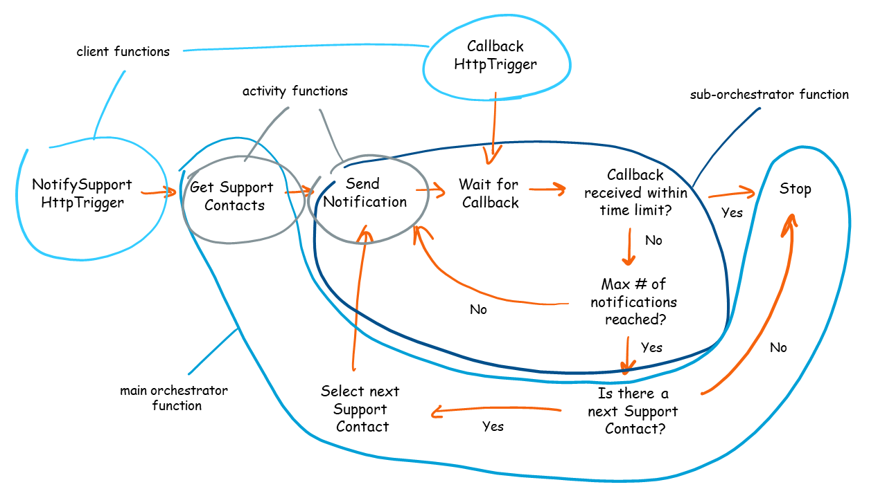

# Tips for building the Notify Support solution

## Main orchestrator

Use the main orchestrator with an activity function to get the list of Support Contacts. This orchestrator needs to iterate over the contacts. Do not use a for/each loop, use the `ContinueAsNew` functionality to restart the orchestrator with the next Support Contact. The main orchestrator also calls a sub-orchestrator that takes care of sending the notifications and waiting for the callback event.

## Sub-orchestrator

Use a sub-orchestrator with an activity function to send the notification to a Support Contact. This sub-orchestrator also waits for the callback event. Use a time-out and a default value when waiting for the event. The `ContinueAsNew` functionality can be used to restart the sub-orchestrator in order to do a notification retry for the same Support Contact. Make sure to only restart the orchestration for the max number of retries per Support Contact.

## Timings when waiting for events

Messaging in Durable Functions is done using Storage Queues. The Durable Functions framework polls these queues to determine if there are tasks to be done. The polling frequency is a configurable value called `maxQueuePollingInterval` in the `hosts.json` file. By default this value is set at 30 seconds. For short wait times regarding events it is useful to set this to a smaller value (such as 2 seconds) to allow more accurate timings.

For more info read:

- [Durable Functions Queue Polling](https://docs.microsoft.com/en-us/azure/azure-functions/durable/durable-functions-perf-and-scale#queue-polling).
- [Durable Functions hosts.json defaults](https://docs.microsoft.com/en-us/azure/azure-functions/durable/durable-functions-bindings#durable-functions-2-0-host-json)

## Handling the callback

Create an HttpTrigger client function to handle the callback and raise the event. When the callback is received, the only information we have is a phone number. The sub-orchestrator is waiting for the callback event, and that event should be raised to that specific sub-orchestrator instance. But we don't have the instance ID of the orchestrator in the callback request. A solution for this is to use Stateful Entities to store the instance ID when the notification is sent, and to read the instance ID when we receive the callback. Use the phone number as entity key.

---
[🔼 Notify Support Challenge](README.md)