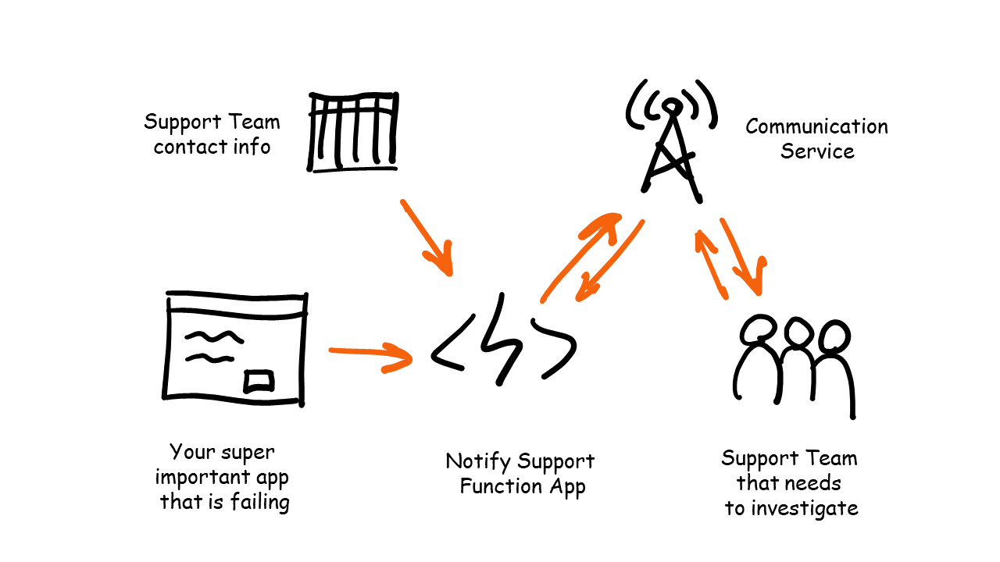
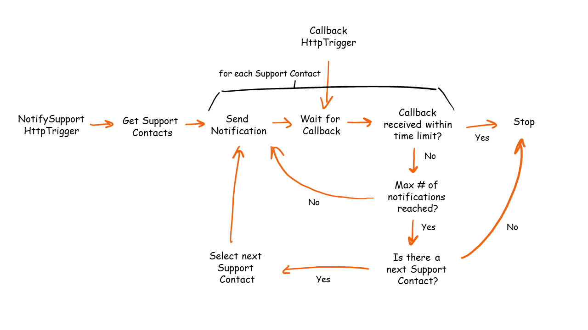

# Notify Support Challenge

## Goal

The goal of this challenge is to write a Function App which responds to alerts (posted as HTTP request) and notifies members of the support team so they can investigate the issue.



### Recording

There is a [recording available on YouTube](https://youtu.be/O6YCRhyqR2w) which explains this challenge and the relevant Durable Functions theory. The solution of this challenge is covered in a separate video.

## Flow Diagram



## Prerequisites

Read the [prerequisites](prerequisites.md) to ensure you have all the right tools installed.

## Durable Functions Theory

Please familiarize yourself with some Durable Functions theory and code samples. These are the building blocks for the solution.

- [Client, Orchestrator & Activity functions](../../DurableFunctionsTheory/durablefunctions.md)
- [Sub-orchestrations](../../DurableFunctionsTheory/suborchestrations.md)
- [Events](../../DurableFunctionsTheory/events.md)
- [Eternal orchestrations](../../DurableFunctionsTheory/eternalorchestrations.md)
- [Stateful Entities](../../DurableFunctionsTheory/statefulentities.md)

## Requirements

The serverless application you'll write, need to do the following things:

1. Respond to an incoming HTTP POST request on a static URL (e.g. `https://localhost:7071/api/NotifySupportHttpClient`). The json body is as follows:

    ```json
    {
        "message" : "The server is on fire!",
        "severity" : 1
    }
    ```

    > For more info about *Azure Functions HttpTriggers* see this [Azure Functions University lesson](https://github.com/marcduiker/azure-functions-university/blob/main/lessons/http-dotnet.md).

2. Support contact information must be read from Table Storage. A [data export](../data/SupportContacts.csv) has been made available which can be imported in a `SupportContacts` table. Only the people in **Team A** are part of the support schedule.

    > For more info about *Table Storage bindings* see [this Azure Functions University lesson](https://github.com/marcduiker/azure-functions-university/blob/main/lessons/table-dotnet.md).

3. The notification process must start with the first support contact in the list (ordered ascending by the `Order` field), if the contact do not respond within 5 minutes the next contact should be notified. This continues until there's no-one available in the support contact list. The time should be a configurable value.

4. Each support contact must be notified 3 times (in total) in case they do not respond immediately. These notification attempts should occur evenly spread within the 5 minute window. The retry number should be a configurable value.

5. Once a support contact responds with a callback the notification process should stop and no other contacts should be notified.

6. The callback response is received as a POST request on a static URL (e.g. `https://localhost:7071/api/CallbackHttpClient`). The body of the request only contains the phone number of the support contact who was notified:

    ```json
    {
        "+31611111111"
    }
    ```

7. For times sake, the actual notification functionality, making phone calls or sending text messages (incl callbacks) can be faked for this challenge. The callback, described in the previous requirement, can be triggered manually via a REST client. If you do have the time, you could try Twilio or Azure Communication Services.

## Build it!

Now it's time to build your solution.

If you need some tips, check [this page](notifysupport-tips.md).

---
[🔼 Main README](../README.md)
