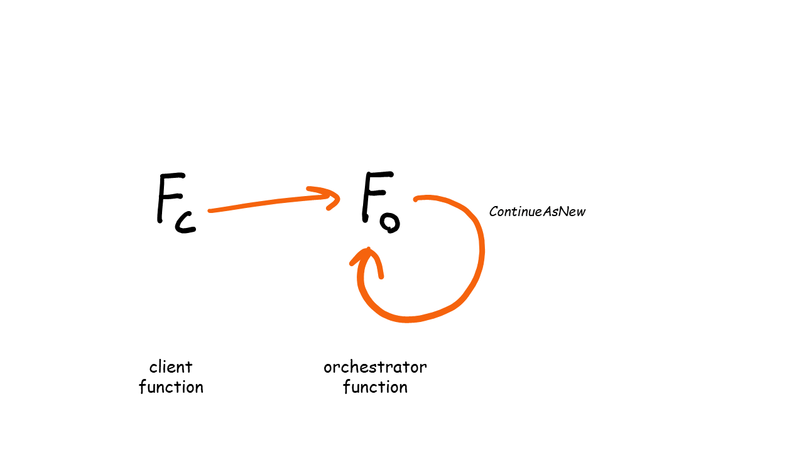

# Eternal Orchestrations

Eternal orchestrators are orchestrators that never finish. They are useful when you want to perform a workflow in a loop.



You can make a conditional eternal orchestrator that only continues the orchestrator inside an `if statement` based on logic you provide (e.g. a result of an activity, sub-orchestrator, or event).

In this example a clean up action is performed as long as there are items to clean up:

```csharp
[FunctionName(nameof(PeriodicCleanupOrchestrator))]
public static async Task Run(
    [OrchestrationTrigger] IDurableOrchestrationContext context)
{
    var itemsToCleanup = context.GetInput<CleanupInput>();

    var updatedItemsToCleanup = await context.CallActivityAsync<CleanupInput>(
        nameof(DoCleanupActivity), 
        itemsToCleanUp);

    if (updatedItemsToCleanup.Any())
    {
        DateTime nextCleanup = context.CurrentUtcDateTime.AddHours(4);
        await context.CreateTimer(nextCleanup, CancellationToken.None);

        context.ContinueAsNew(updatedItemsToCleanup);
    }
}
```

## Official Docs

[Eternal orchestrations in Durable Functions](https://docs.microsoft.com/en-us/azure/azure-functions/durable/durable-functions-eternal-orchestrations?tabs=csharp)

---
[◀ Sub-orchestrations](suborchestrations.md) | [🔼 Challenge](notifysupport.md) | [Events ▶](events.md)
