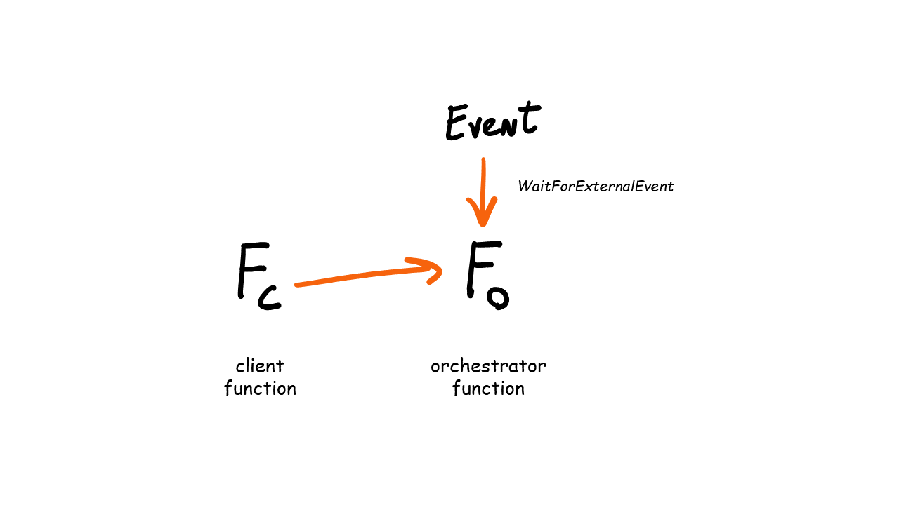
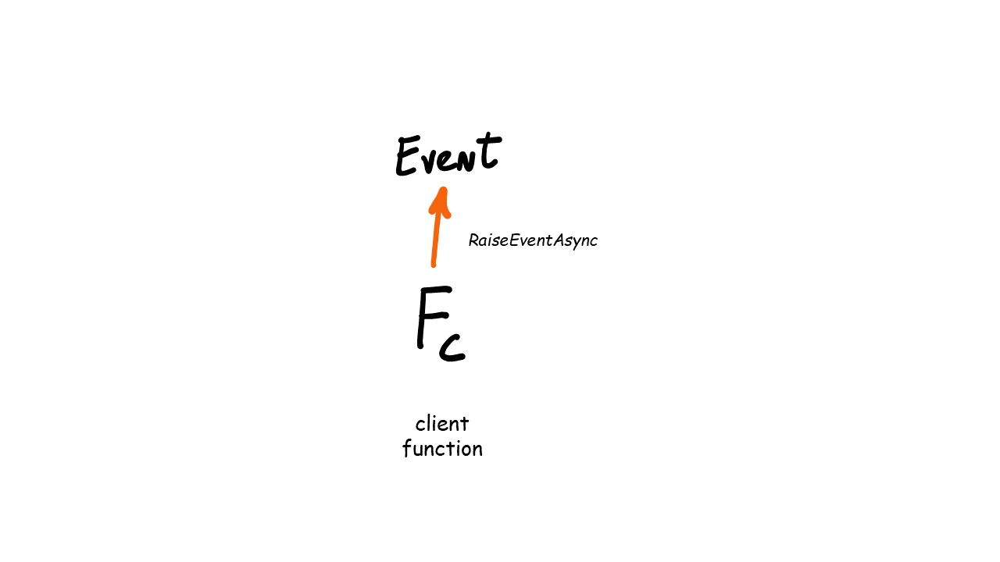

# Events

Orchestrator functions have the ability to wait and listen for external events. This is useful when interaction with another system is required, e.g. the orchestrator can't continue unless a callback from an external API is received. Or a person need to perform an approval step before the orchestrator can continue.

## Waiting for events



This code sample shows how an orchestrator waits for events.

```csharp
[FunctionName(nameof(ApprovalOrchestrator))]
public static async Task Run(
    [OrchestrationTrigger] IDurableOrchestrationContext context)
{
    var timeout = TimeSpan.FromHours(1);
    bool approved = await context.WaitForExternalEvent<bool>("ApprovalEvent", timeout, false);
    if (approved)
    {
        // approval granted - do the approved action
    }
    else
    {
        // approval denied - do the not approved action
    }
}
```

## Raising events



This example shows how to raise an event from a Durable Functions client function.

```csharp
[FunctionName(nameof(CallbackHttpClient))]
public static async Task<IActionResult> Run(
    [HttpTrigger(
        AuthorizationLevel.Function,
        nameof(HttpMethod.Post),
        Route = null)] HttpRequestMessage message,
    [DurableClient] IDurableClient client,
    ILogger logger)
{
    var approvalResult = await message.Content.ReadAsAsync<ApprovalResult>();
            
    await client.RaiseEventAsync(
        approvalResult.OrchestratorInstanceId,
        approvalResult.EventName,
        approvalResult.IsApproved);

    return new AcceptedResult();
}

```

Besides using the .NET API, events can also be raised using the [built-in HTTP API](https://docs.microsoft.com/en-us/azure/azure-functions/durable/durable-functions-http-api#raise-event).

## Official Docs

[Handling external events in Durable Functions](https://docs.microsoft.com/en-us/azure/azure-functions/durable/durable-functions-external-events?tabs=csharp)

---
[◀ Eternal Orchestrations](eternalorchestrations.md) | [🔼 Notify Support Challenge](notifysupport.md) | [Stateful Entities ▶](statefulentities.md)
